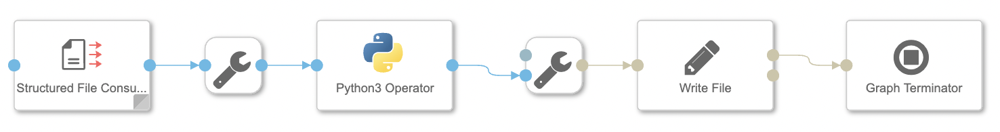
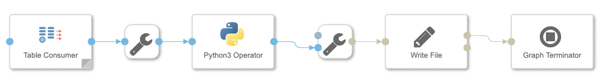
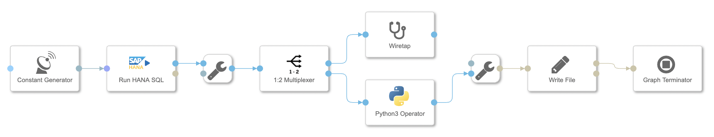
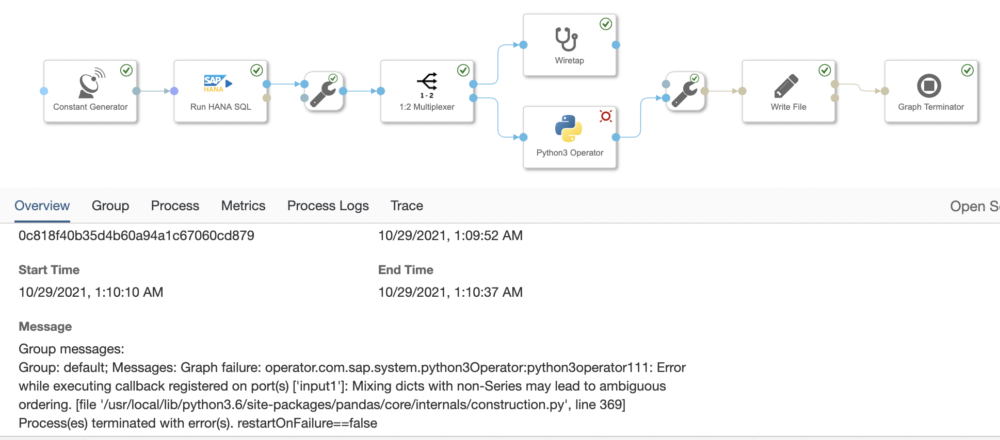
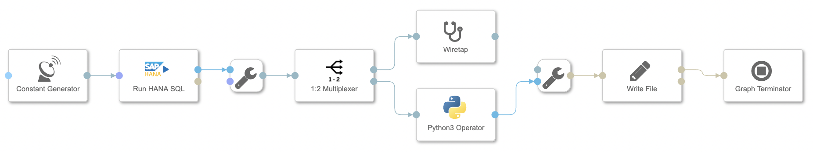

Python3 Operator 처리 예제
===

# 1. File to Python 처리
## 1.1 Read File Operator : message.file - message Type
<br>
Read File --> From File --> Python3 --> To File --> Write File --> Graph Terminator

```python
from io import StringIO
import pandas as pd

def on_input(msg):

    data = StringIO(msg.body.decode("utf-8"))

    df = pd.read_csv(data, sep=';')
    result = df
    csv = result.to_csv(sep=',', index=False)

    api.send("output1", api.Message(attributes=msg.attributes, body=csv))

api.set_port_callback("input1", on_input)
```

## 1.2 Read File Operator : message.file - string Data Type
<br>
Read File --> ToString Coverter --> Python3 --> To File --> Write File --> Graph Terminator

```python
from io import StringIO
import pandas as pd

def on_input(msg):

    data = StringIO(msg)

    df = pd.read_csv(data, sep=';')
    result = df
    csv = result.to_csv(sep=',', index=False)

    api.send("output1", csv)

api.set_port_callback("input1", on_input)
```

## 1.3 Structured File Consumer Operator : table - message Type
<br>
Structured File Consumer --> Table To Message Converter --> Python3 --> To File --> Write File --> Graph Terminator<br>
Table To Message Converter에서 string 데이터 타입 변환 중 오류 발생됨

```python
from io import StringIO
import pandas as pd

def on_input(msg):

    data = StringIO(msg.body)

    df = pd.read_csv(data, sep=',')
    result = df
    csv = result.to_csv(sep=',', index=False)

    api.send("output1", api.Message(attributes=msg.attributes, body=csv))

api.set_port_callback("input1", on_input)
```

# 2. HANA to Python 처리

## 2.1 HANA Client Operator : message <-> message Type
<br>
Constant Generator --> HANA Client --> Python3 --> To File --> Write File --> Graph Terminator

```python
from io import StringIO
import pandas as pd

def on_input(msg):

    data = pd.DataFrame(msg.body)

    #df = pd.read_csv(data, sep=',')
    result = data
    csv = result.to_csv(sep=',', index=False)

    api.send("output1", api.Message(attributes=msg.attributes, body=csv))

api.set_port_callback("input1", on_input)
```

## 2.2 HANA Client Operator : message <-> blob <-> string Type
<br>
Constant Generator --> HANA Client --> ToBlob Converter --> Format Converter --> ToString Converter --> Python3 --> To File --> Write File --> Graph Terminator

```python
from io import StringIO
import pandas as pd

def on_input(msg):

    data = StringIO(msg)

    df = pd.read_csv(data, sep=',')
    result = df
    csv = result.to_csv(sep=',', index=False)

    api.send("output1", csv)

api.set_port_callback("input1", on_input)
```

## 2.3 Table Consumer Operator : table <-> message Type
<br>
Table Consumer --> Table To Message Converter --> Python3 --> To File --> Write File --> Graph Terminator

```python
from io import StringIO
import pandas as pd

def on_input(msg):

    data = StringIO(msg.body)

    df = pd.read_csv(data, sep=',')
    result = df
    csv = result.to_csv(sep=',', index=False)

    api.send("output1", api.Message(attributes=msg.attributes, body=csv))

api.set_port_callback("input1", on_input)
```

## _오류 Run HANA SQL Operator : message.table <-> message Type_
<br>
<br>
Constant Generator --> Run HANA SQL --> ToMessage Converter --> Python3 --> To File --> Write File --> Graph Terminator<br>
오류 발생됨

```python
from io import StringIO
import pandas as pd

def on_input(msg):

    #data = StringIO(msg.body.decode("utf-8"))
    #data = StringIO(msg.body)
    data = pd.DataFrame(msg.body)

    #df = pd.read_csv(data, sep=',')
    result = data
    csv = result.to_csv(sep=',', index=False)

    api.send("output1", api.Message(attributes=msg.attributes, body=csv))
    #api.send("output1", csv)

api.set_port_callback("input1", on_input)
```

## _오류 Run HANA SQL Operator : message.table <-> string Type_
<br>
Constant Generator --> Run HANA SQL --> ToString Converter --> Python3 --> To File --> Write File --> Graph Terminator<br>
오류 발생됨 - 데이터 출력 형식 틀림

```python
from io import StringIO
import pandas as pd

def on_input(msg):

    data = StringIO(msg)

    df = pd.read_csv(data, sep=',')
    result = df
    csv = result.to_csv(sep=',', index=False)

    api.send("output1", csv)

api.set_port_callback("input1", on_input)
```

# 3. Python to HANA 처리
## 3.1 HANA Client Operator : message <-> message Type
<br>
Read File --> From File --> Python3 --> HANA Client --> Graph Terminator

```python
from io import StringIO
import pandas as pd

def on_input(msg):

    data = StringIO(msg.body.decode("utf-8"))

    df = pd.read_csv(data, sep=';')
    result = df
    csv = result.to_csv(sep=',', index=False)

    api.send("output1", api.Message(attributes=msg.attributes, body=csv))

api.set_port_callback("input1", on_input)
```

## _오류 Write HANA SQL Operator : message <-> message.table Type_
<br>
Read File --> From File --> Python3 --> Decode Table --> Write HANA Table --> Graph Terminator<br>
오류 발생됨

```python
from io import StringIO
import pandas as pd

def on_input(msg):

    data = StringIO(msg.body.decode("utf-8"))

    df = pd.read_csv(data, sep=';')
    result = df
    csv = result.to_csv(sep=',', index=False)

    api.send("output1", api.Message(attributes=msg.attributes, body=csv))

api.set_port_callback("input1", on_input)
```
