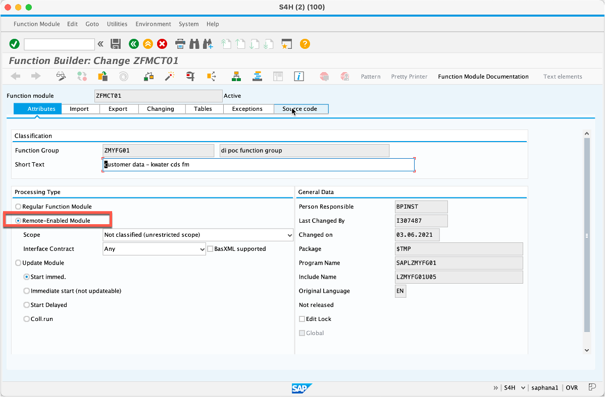
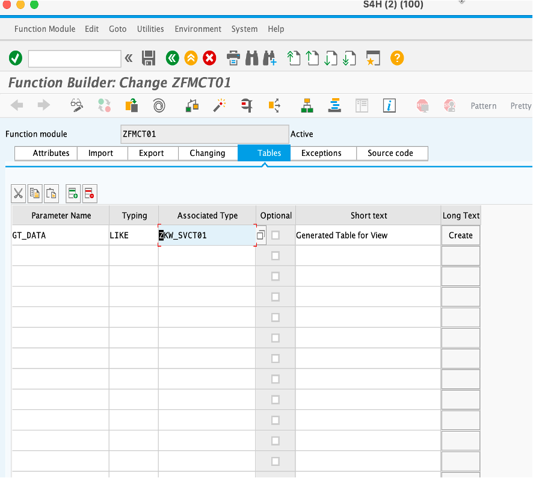
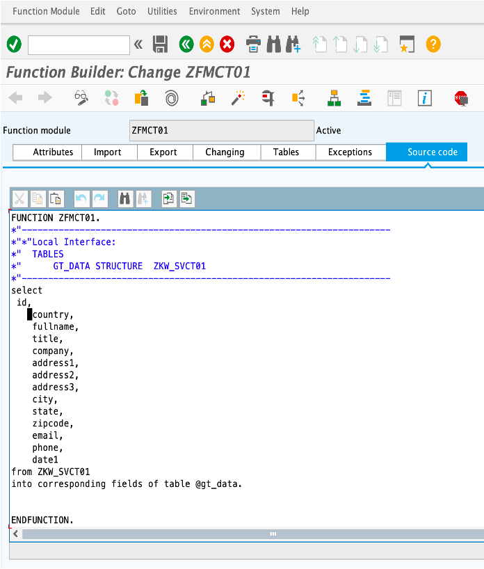
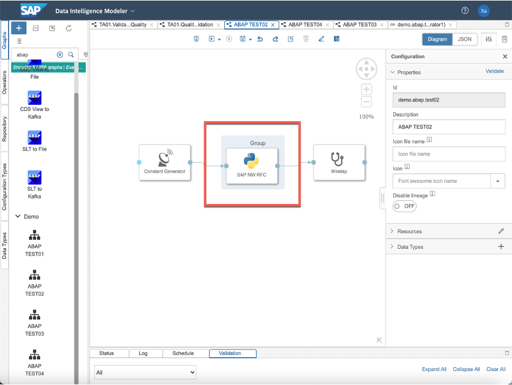
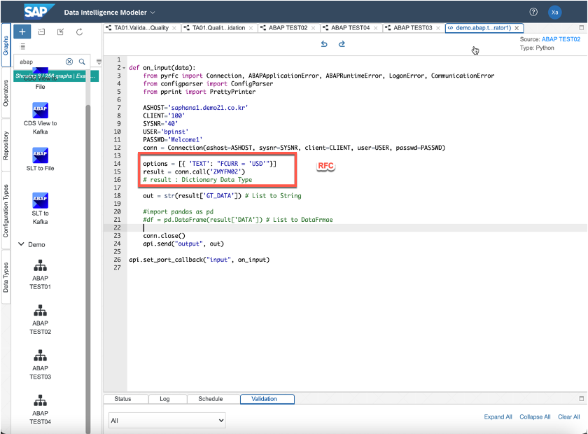

# CDS View 데이터 추출

SAP Data Intelligence는 ABAP 기반 시스템의 데이터를 외부로 추출하는 기능을 제공합니다. 
표준 ABAP CDS View Operator를 사용하여 데이터 추출을 지원합니다. 
하지만, S/4HANA 버전에 따라 
데이터를 추출하기 위한 표준 CDS View Operator를 제공합니다. 이 때, S/4HANA OP 환경에서는 1909 버전 이상 과 S/4HANA Cloud 환경에선느 2002 버전 이상일 때 사용이 가능합니다.
만약, S/4HANA OP 1909 버전 이하일 때는 Custom Operator를 제작하여 사용이 가능합니다.

## 표준 ABAP Operator
S/4HANA OP ver. >= 1909 또는 S/4HANA Cloud ver. >= 2002 부터 표준 ABAP Operator를 사용하여 ABAP CDS View 데이터를 추출합니다. 
Update 예정

## Custom Operator
S/4HANA OP ver. < 1909 또는 S/4HANA Cloud ver. < 2002 경우, Custom Operator를 제작하여 ABAP CDS View 데이터를 추출합니다. 

### 1. CDS View 생성
ADT를 사용하여 CDS View를 생성합니다. 

    @AbapCatalog.sqlViewName: 'ZKW_SVBP01'
    @AbapCatalog.compiler.compareFilter: true
    @AbapCatalog.preserveKey: true
    @AccessControl.authorizationCheck: #CHECK
    @EndUserText.label: 'business partner - kwater cds'
    @Analytics.dataExtraction.delta.changeDataCapture.automatic: true
    @Analytics.dataExtraction.enabled: true
    define view ZKW_CDSBP01 as select from zbp01 {
    key    customer_id,
        loan_id,
        gender,
        married,
        dependents,
        education,
        self_employed,
        credit_history
    }

### 2. RFC에서 CDS View 호출
CDS View를 RFC 호출할 수 있도록 합니다. 

 
 
 

### 3. Custom Operator에서 RFC 호출
Data Intelligence의 Modeler에서 Pipeline를 생성하고 실행합니다. 
이 때, Python3 Operator를 사용하여 Custom Operator를 생성합니다. 

 

    def on_input(data):
        from pyrfc import Connection, ABAPApplicationError, ABAPRuntimeError, LogonError, CommunicationError
        from configparser import ConfigParser
        from pprint import PrettyPrinter

        ASHOST='xxx.xxx.xxx.xxx'
        CLIENT='100'
        SYSNR='40'
        USER='UserID'
        PASSWD='Password'
        conn = Connection(ashost=ASHOST, sysnr=SYSNR, client=CLIENT, user=USER, passwd=PASSWD)

        options = [{ 'TEXT': "FCURR = 'USD'"}]
        result = conn.call('RFC_READ_TABLE', \
                            QUERY_TABLE = 'TCURR', \
                            OPTIONS = options)
        # result : Dictionary Data Type

        out = str(result['DATA']) # List to String

        #import pandas as pd
        #df = pd.DataFrame(result['DATA']) # List to DataFrmae

        conn.close()
        api.send("output", out)

    api.set_port_callback("input", on_input)

 

감사합니다.
