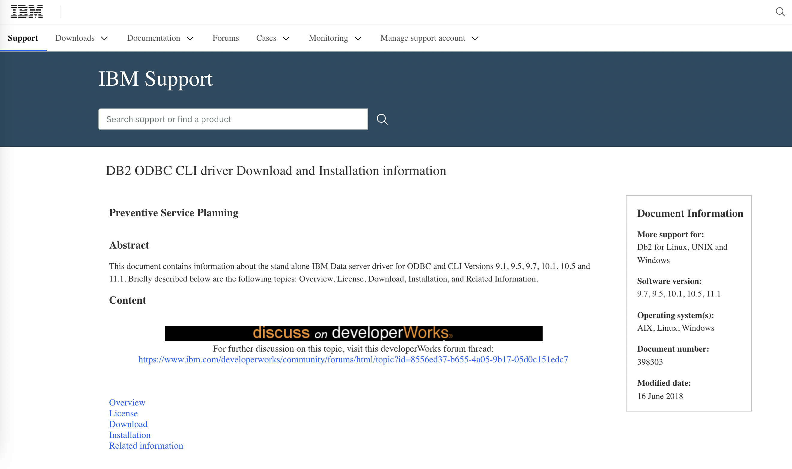
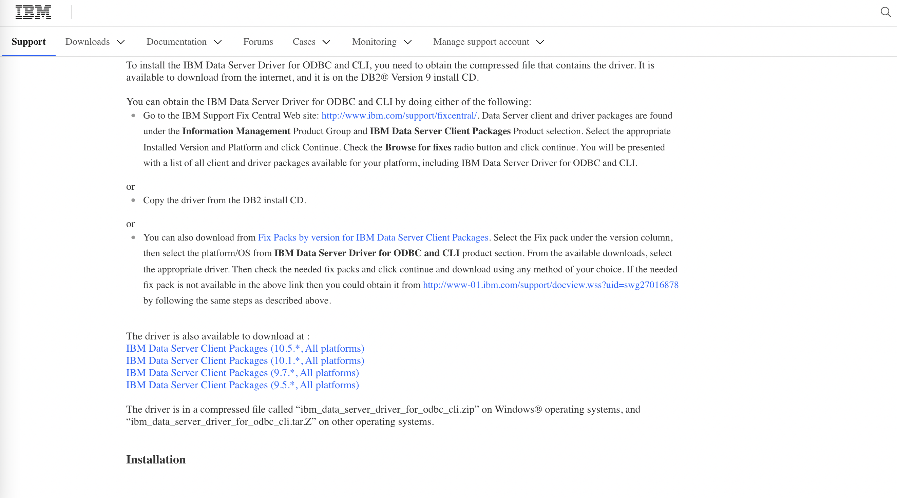
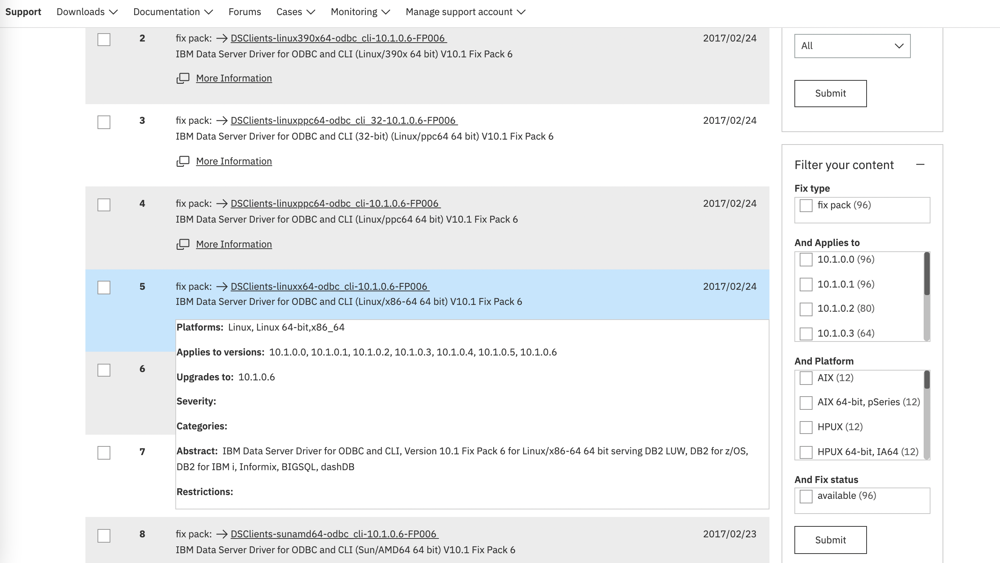
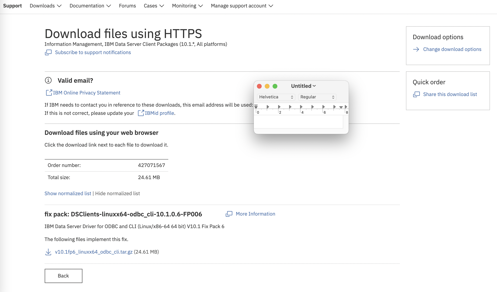
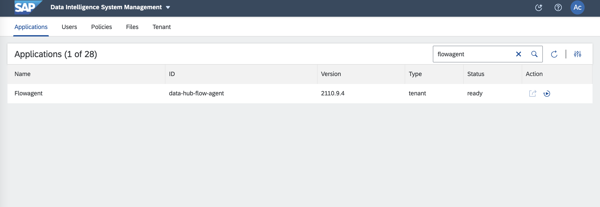
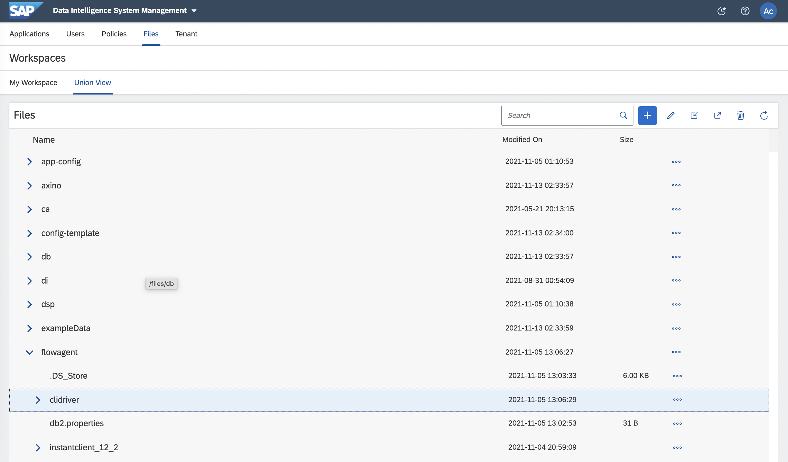

# DB2 vsolution Example

DB2 DB에 액세스 하려면 먼저 IBM Data Server Driver for ODBC and CLI (CLI Driver)를 다운로드 및 등록해야 합니다. <br>


### 1. Create db2_vsolution
DB2 ODBC CLI driver 프로그램(Version 10.1, Linux x86_64)를 다운로드 합니다.<br>
https://www.ibm.com/support/pages/db2-odbc-cli-driver-download-and-installation-information
<br>

Download 선택 <br>

 <br>

IBM Data Server Packages (10.1.*,All platforms) 선택 <br>

 <br>

DSClients-linuxx64-odbc_cli-10.1.0.6-FP006 선택 <br>

 <br>

v10.1fp6_linuxx64_odbc_cli.tar.gz 를 다운로드 합니다.<br>

 <br>

```shell
# 디렉토리
mkdir -p db2_vsolution/content/files/flowagent
```

```shell
# solution 이름과 버전
vi db2_vsolution/manifest.json

{
    "name": "vsolution_db2",
    "version": "1.0.0",
    "format": "2",
    "dependencies": []
}
```

```shell
# Client 프로그램의 압축 풀기 및 파일 링크 설정
tar -xvzf v10.1fp6_linuxx64_odbc_cli.tar.gz -C db2_vsolution/content/files/flowagent
```

```shell
# DB 환경변수 설정
vi db2_vsolution/content/files/flowagent/db2.properties

DB2_CLI_DRIVER=./clidriver/lib
```

```shell
# solution 파일 생성
cd db2_vsoltion

zip -r db2_vsolution.zip ./

ls -F
content/		db2_vsolution.zip	manifest.json
```


### 2. Import db2 solution

DI Launchpad -> System Management<br>
Tenant -> Solutions -> '+' button <br>

 <br>

db2_vsolution.zip 파일 선택 <br>

vsolution_db2 확인 <br>


Tenant -> Strategy -> 'Edit' button <br>

<br>

'+' button <br>

<br>

vsolution_db2-1.0.0 선택 <br>

'Save' button <br>


### 3. Restart flowagent

DI Launchpad -> System Management<br>
Applications -> 'flowagent' Search -> Restart Icon <br>

<br>


### 4. Tenant 환경에서 flowagent 확인

Fils -> Union View <br>
files -> flowagent -> clidriver 디렉토리, db2.properties 파일 <br>

<br>
