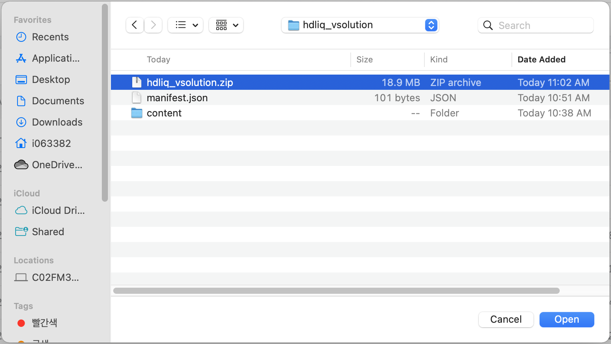
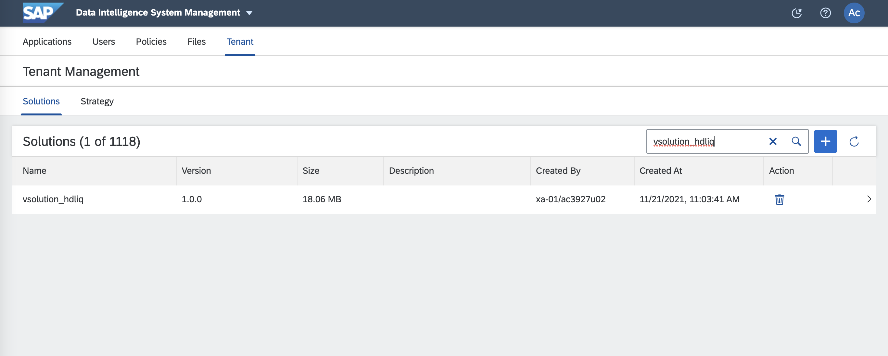
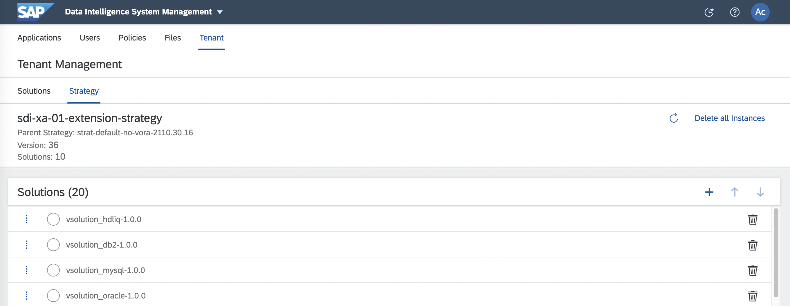
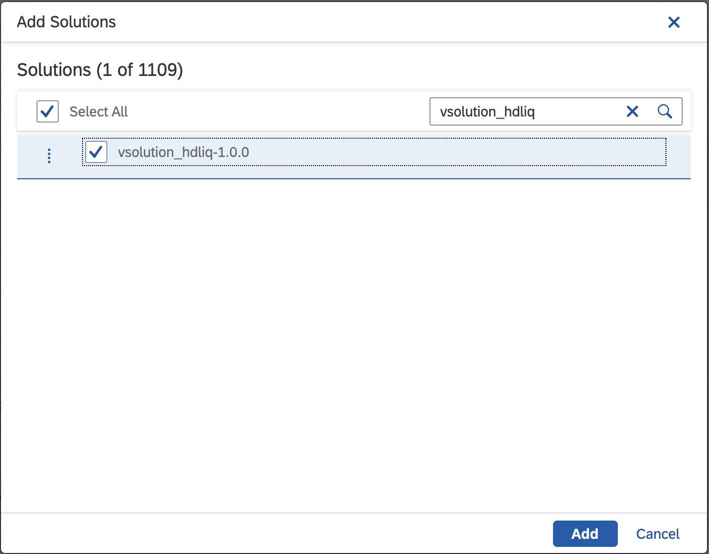
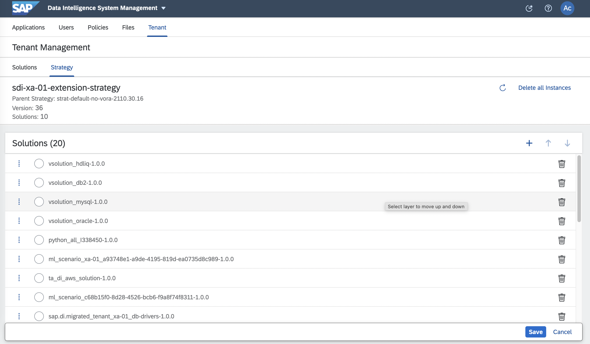
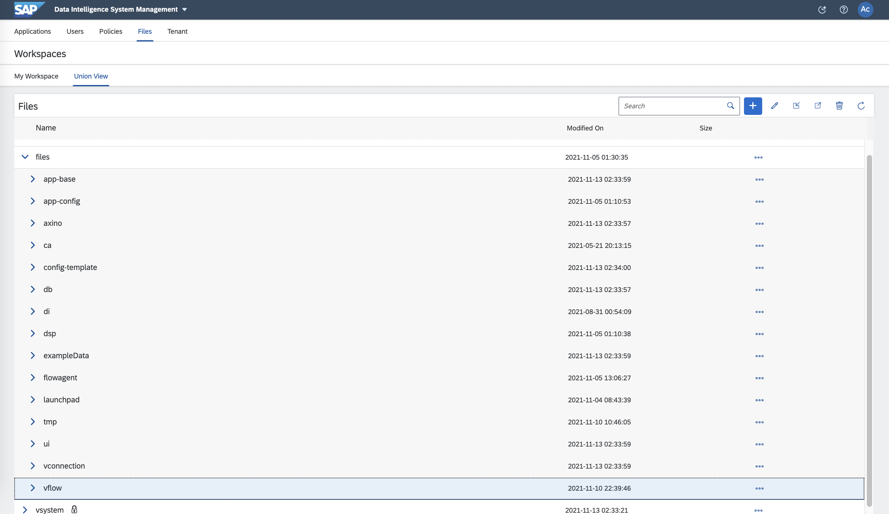
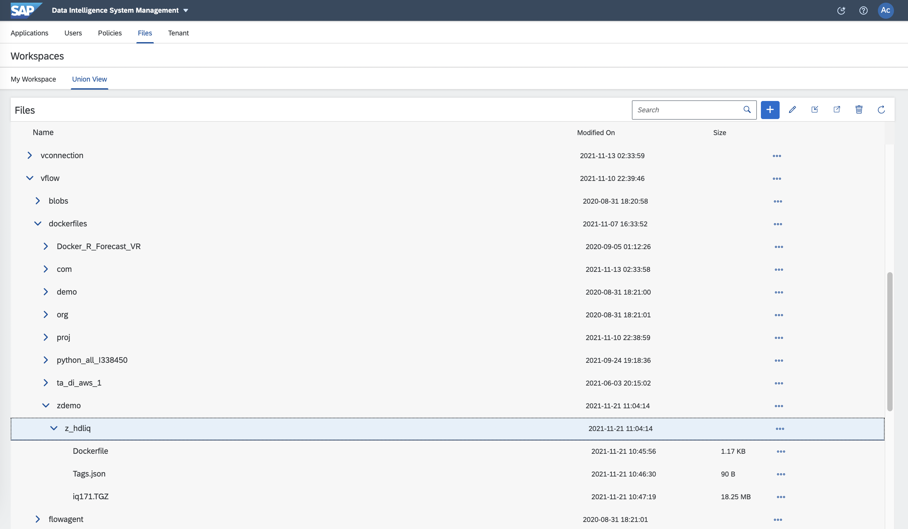
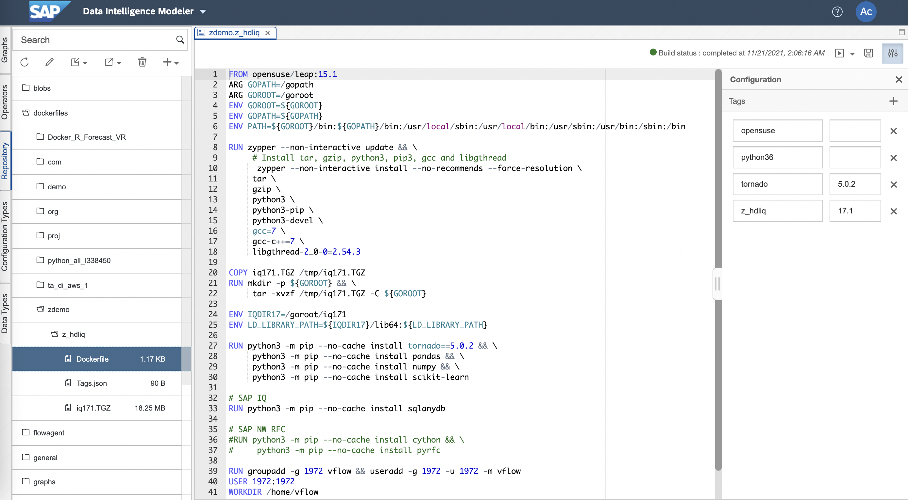

# hdliq dockerfile vsolution Example

### 1. Create hdliq_vsolution

```shell
mkdir -p hdliq_vsolution/content/files/vflow/dockerfiles/zdemo/z_hdliq
```

```shell
cp Dockerfile hdliq_vsolution/content/files/vflow/dockerfiles/zdemo/z_hdliq

cp Tags.json hdliq_vsolution/content/files/vflow/dockerfiles/zdemo/z_hdliq

cp iq171.TGZ hdliq_vsolution/content/files/vflow/dockerfiles/zdemo/z_hdliq
```

```shell
vi hdliq_vsoltion/manifest.json
{
    "name": "vsolution_hdliq",
    "version": "1.0.0",
    "format": "2",
    "dependencies": []
}
```

```shell
cd hdliq_vsoltion

zip -r hdliq_vsolution.zip ./

ls -F
content/		hdliq_vsolution.zip	    manifest.json
```


<!--img src="images/jupyter_pipeline4.png" width="550" height="150"/-->

### 2. Import hdliq solution

DI Launchpad -> System Management<br>
Tenant -> Solutions -> '+' button <br>

 <br>

hdl_vsolution.zip 파일 선택 <br>

 <br>

vsolution_hdliq 확인 <br>

<br>

Tenant -> Strategy -> 'Edit' button <br>

<br>

Add Solutions -> '+' Button <br>

<br>

<br>

<br>

<br>

<br>

<br>

