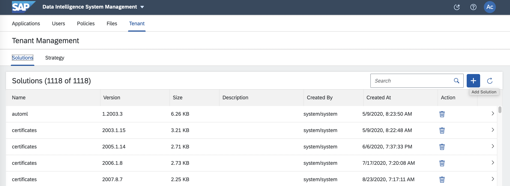

# hdliq dockerfile vsolution Example

### 1. Create hdliq_vsolution

```shell
# 디렉토리
mkdir -p hdliq_vsolution/content/files/vflow/dockerfiles/zdemo/z_hdliq
```

```shell
# solution 이름과 버전
vi hdliq_vsoltion/manifest.json
{
    "name": "vsolution_hdliq",
    "version": "1.0.0",
    "format": "2",
    "dependencies": []
}
```

```shell
# 관련 파일 복사
cp mainfest.json hdliq_vsolution
cp Dockerfile hdliq_vsolution/content/files/vflow/dockerfiles/zdemo/z_hdliq
cp Tags.json hdliq_vsolution/content/files/vflow/dockerfiles/zdemo/z_hdliq
cp iq171.TGZ hdliq_vsolution/content/files/vflow/dockerfiles/zdemo/z_hdliq
```


```shell
# solution 파일 생성
cd hdliq_vsoltion

ls -F
content/		hdliq_vsolution.zip	    manifest.json

zip -r hdliq_vsolution.zip ./
```


<!--img src="images/jupyter_pipeline4.png" width="550" height="150"/-->

### 2. Import hdliq solution

DI Launchpad -> System Management<br>
Tenant -> Solutions -> '+' button <br>

 <br>

hdl_vsolution.zip 파일 선택 <br>

 <br>

vsolution_hdliq 확인 <br>

<br>

Tenant -> Strategy -> 'Edit' button <br>

<br>

'+' button <br>

<br>

vsolution_hdliq-1.0.0 선택 <br>

 <br>

'Save' button <br>

<br>

### 3. Tenant 환경에서 Dockerfile 확인

Fils -> Union View <br>
files -> vflow -> dockerfiles -> zdemo -> z_hdliq<br>

<br>
<br>

### 4. 사용자 환경에서 Dockerfile 확인

DI Launchpad -> Modeler <br>
Repository -> dockerfiles -> zdemo -> z_hdliq -> Dockerfile <br>

<br>

