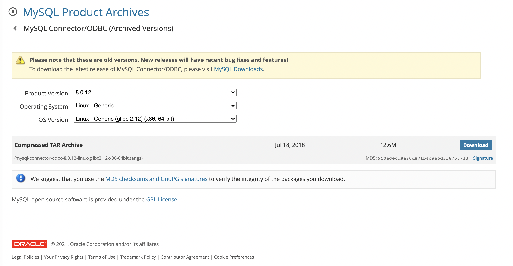

# MySQL vsolution Example

MySQL DB에 액세스 하려면 먼저 MySQL ODBC Connector를 다운로드 및 등록해야 합니다. <br>


### 1. Create mysql_vsolution
MySQL ODBC Connector 프로그램(Version 8.0.12, Linux - Generic (glibc 2.12)(x86,64-bit))를 다운로드 합니다.<br>
https://downloads.mysql.com/archives/c-odbc/
<br>

버전은 반드시 8.0.12를 선택합니다. 다른 버전 선택 시 연결 이슈가 발생할 수도 있습니다. <br>
mysql-connector-odbc-8.0.12-linux-glibc2.12-x86-64bit.tar.gz) 를 다운로드 합니다.<br>

 <br>

```shell
# 디렉토리
mkdir -p oracle_vsolution/content/files/flowagent
```

```shell
# solution 이름과 버전
vi oracle_vsolution/manifest.json

{
    "name": "vsolution_oracle",
    "version": "1.0.0",
    "format": "2",
    "dependencies": []
}
```

```shell
# Client 프로그램의 압축 풀기 및 파일 링크 설정
unzip instantclient-basic-linux.x64-12.2.0.1.0.zip  -d oracle_vsolution/content/files/flowagent/

cd oracle_vsolution/content/files/flowagent/instantclient_12_2  

ln -s libclntsh.so.12.1 libclntsh.so.12  

ln -s libclntsh.so.12 libclntsh.so

ln -s libclntshcore.so.12.1 libclntshcore.so.12

ln -s libclntshcore.so.12 libclntshcore.so

ln -s libocci.so.12.1 libocci.so.12

ln -s libocci.so.12 libocci.so
```

```shell
# DB 환경변수 설정
vi oracle_vsolution/content/files/flowagent/oracle.properties

ORACLE_INSTANT_CLIENT=./instantclient_12_2
NLS_LANG=AMERICAN_AMERICA.UTF8
```

```shell
# solution 파일 생성
cd oracle_vsoltion

zip -y -r oracle_vsolution.zip ./

ls -F
content/			manifest.json		oracle_vsolution.zip
```


<!--img src="images/jupyter_pipeline4.png" width="550" height="150"/-->


### 2. Import oracle solution

DI Launchpad -> System Management<br>
Tenant -> Solutions -> '+' button <br>

 <br>

oracle_vsolution.zip 파일 선택 <br>

vsolution_oracle 확인 <br>


Tenant -> Strategy -> 'Edit' button <br>

<br>

'+' button <br>

<br>

vsolution_oracle-1.0.0 선택 <br>

'Save' button <br>


### 3. Restart flowagent

DI Launchpad -> System Management<br>
Applications -> 'flowagent' Search -> Restart Icon <br>

<br>


### 4. Tenant 환경에서 flowagent 확인

Fils -> Union View <br>
files -> flowagent -> instantclient_12_2 디렉토리 and oracle.properties 파일 <br>

<br>

